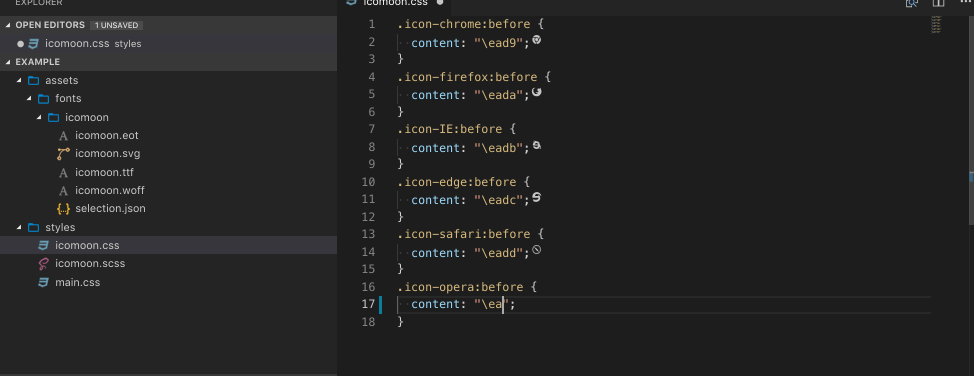

## Features

Preview Icomooon icons into your style files.

## Requirements

Your project needs to have a file called `Icomoon.svg` _(is tipically generated by Icomoon website)_

## Supported file extensions

- .css
- .scss
- .sass
- .less

## Known Issues

The icons are not vertically centered.

## Contributors
|  **Quique Fdez Guerra** [👨‍💻](https://github.com/CKGrafico)[🌍](http://ckgrafico.com)[🐦](https://twitter.com/CKGrafico) |
| :---: |